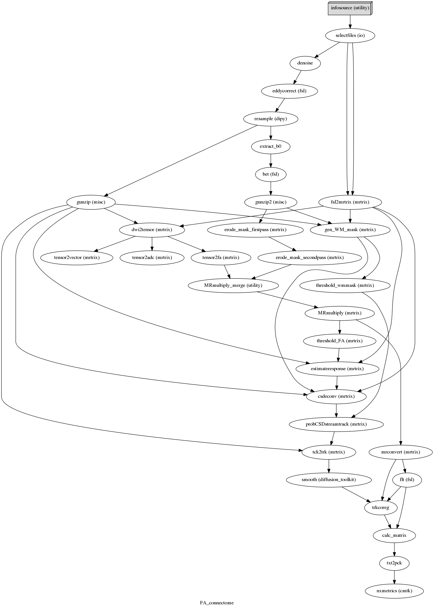

## Structural connectome analysis in a single-gene disorder 

This repository contains the code for the structural connectome analysis presented in  

Joe Bathelt, Jessica Barnes, F Lucy Raymond, Kate Baker, Duncan Astle (*in preparation*): "Global and local connectivity differences converge with gene expression in a single-gene disorder associated with epilepsy, language impairment, and intellectual disability
"

### Description of Methods:  

The white-matter connectome reconstruction followed a commonly used procedure of estimating the most probable white matter connections for each individual, and then obtaining measures of fractional anisotropy (FA) between cortical regions after transformation to common space (Horn 2016). The details of the procedure are described in the following paragraphs.

In the current study, MRI scans were converted from the native DICOM to compressed NIfTI-1 format using the dcm2nii tool developed at the McCauseland Centre for Neuroimaging http://www.mccauslandcenter.sc.edu/
mricro/mricron/dcm2nii.html. Subsequently, the images were submitted to an implementation of a non-local means de-noising algorithm (Coupe 2008) in the Diffusion Imaging in Python (DiPy) v0.8.0 package (Garyfallidis 2014) to boost signal to noise ratio. Next, a brain mask of the b0 image was created using the brain extraction tool (BET) of the FMRIB Software Library (FSL) v5.0.8. Motion and eddy current correction were applied to the masked images using FSL routines. The corrected images were re-sliced to 1mm resolution with trilinear interpolation using in-house software based on NiBabel v2.0.0 functions http://nipy.org/nibabel/. A spherical constrained deconvolution (CSD) model was fitted to the 60 gradient direction diffusion-weighted images using a maximum harmonic order of 8. Correct anatomical orientation of CSD glyphs was visually inspected for white matter tracts of known orientation (corpus callosum, cortico-spinal tract).

A whole-brain tractography was generated by seeding streamlines from each voxel within the brain mask using the probabilistic tractography algorithm of MRTrix (Tournier 2012). The desired number of streamlines was set to 150,000. Other settings followed the recommendations for MRTrix: The fibre tracking algorithm was set to a minimum and maximum track length of 10mm and 200mm respectively. The minimum radius of curvature was set to 1 mm and the track size to 0.2mm. The track termination threshold was set to an FA value of 0.1.

Subsequently, a 12 degree-of-freedom affine transform between each participant’s skull-stripped FA image and the FMRIB58 template in MNI152 was calculated with the correlation ratio as the cost function using FSL FAST. This transform was applied to the streamlines in each participant’s anatomical space to move them into MNI common space (Horn 2016) using a TrackVis v0.6.01 algorithm (Wang et al., 2007).
For structural connectome analysis, regions of interests (ROIs) were based on the Desikan-Killiany parcellation of the MNI template (Klein & Tourville 2012) with 34 ROIs per hemisphere. The ROIs filled the space between the cortical grey and white matter so that streamlines would terminate at the edges of the ROI. For each pairwise combination of ROIs, the number of streamlines intersecting both ROIs was estimated and transformed to a density map. This density map was binarized and multiplied with the FA map to obtain the FA value corresponding to the connection between the ROIs. This procedure was implemented in-house based on DiPy v0.8.0 functions (Garyfallidis 2014). Only cortical ROIs were considered in the current analysis, because Allen Brain atlas data could only be mapped for these ROIs (French & Paus, 2015). Visualizations of the structural connectome were generated using the BrainNet Viewer toolbox (Xia et al., 2013). 

**References**:   
Coupe, P., Yger, P., Prima, S., Hellier, P., Kervrann, C., & Barillot, C. (2008, apr). An Optimized Blockwise Nonlocal Means Denoising Filter for 3-D Magnetic Resonance Images. IEEE Transactions on Medical Imaging, 27(4), 425–441.

French, L., & Paus, T. (2015, sep). A FreeSurfer view of the cortical transcriptome generated from the Allen Human Brain Atlas. Front. Neurosci., 9.

Garyfallidis, E., Brett, M., Amirbekian, B., Rokem, A., Walt, S. van der, Descoteaux, M., . (2014, feb). Dipy a library for the analysis of diffusion MRI data. Front. Neuroinform., 8.

Horn, A., & Blankenburg, F. (2016, jan). Toward a standardized structural–functional group connectome in MNI space. NeuroImage, 124, 310–322.

Klein, A., & Tourville, J. (2012). 101 labeled brain images and a consistent human cortical labeling protocol. Frontiers in Neuroscience, 6(DEC), 171. http://doi.org/10.3389/fnins.2012.00171

Tournier, J.-D., Calamante, F., & Connelly, A. (2012, feb). MRtrix: Diffusion tractography in crossing fiber regions. Int. J. Imaging Syst. Technol., 22(1), 53–66.

Wang, R., Benner, T., Sorensen, A. G., Wedeen, V. J. (2007). Diffusion toolkit: A software package for diffusion imaging data processing. Proc. Intl. Soc. Mag. Reson. Med. 15. http://cds.ismrm.org/ismrm-2007/files/03720.pdf

Xia, M., Wang, J., & He, Y. (2013). BrainNet Viewer: A Network Visualization Tool for Human Brain Connectomics. Plos One, 8(7), e68910. http://doi.org/10.1371/journal.pone.0068910

### Overview
Here is a brief description of the scripts and their use:

**FAconnectome.py**: this script contains a workflow that takes raw diffusion-weighted NifTI files and generates an FA-weighted connectivity matrix for each input file. This requires an ROI file in MNI space.

**GeneExpression_on_CorticalSurface.py**: function used to map gene expression data on the cortical surface

**GraphTheoryAnalysis.py**: this script calculates the graph metrics that were analysed in the study

**DKAtlas_ROIs.py**: functions to get labels corresponding to regions in the Desikan-Killiany atlas from a FreeSurfer look-up table. Also contains a function to remove non-cortical ROIs. 

#### Grpahical representation of the FA connectome workflow

