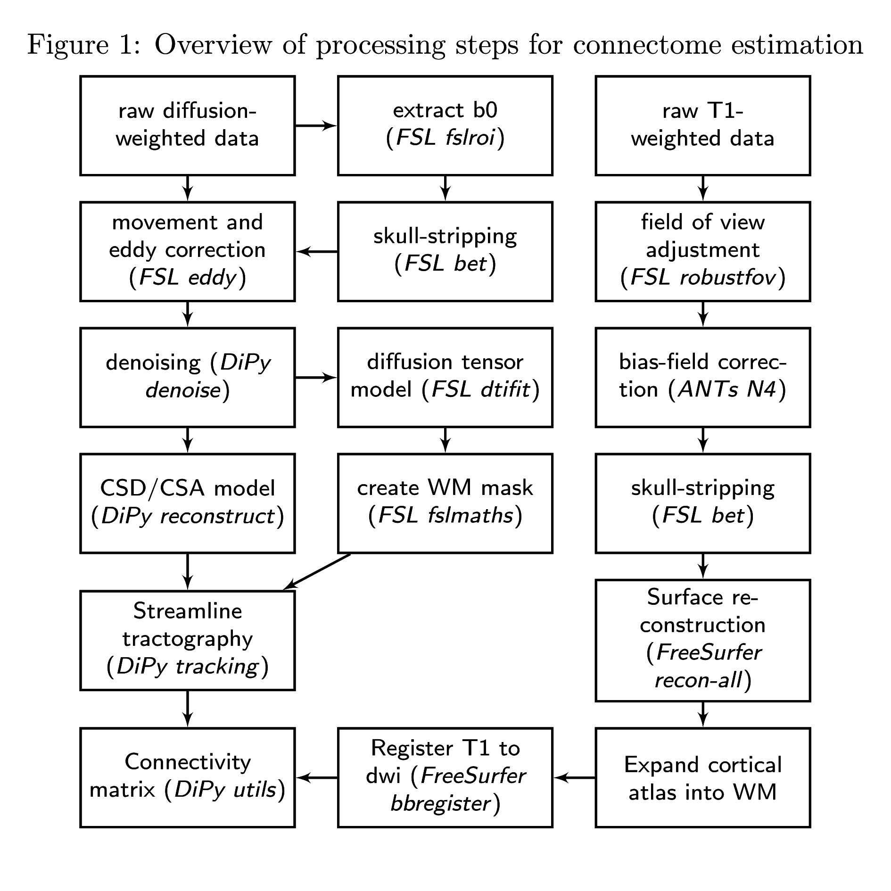

## Structural connectome analysis in a single-gene disorder

This repository contains the code for the structural connectome analysis presented in

Joe Bathelt, Jessica Barnes, F Lucy Raymond, Kate Baker, Duncan Astle (2017): "Global and local connectivity differences converge with gene expression in a single-gene disorder associated with epilepsy, language impairment, and intellectual disability" Cerebral Cortex

### Description of Methods:
The white-matter connectome reconstruction followed the general procedure of estimating the most probably white matter connections for each individual, and then obtaining measures of fractional anisotropy (FA) between regions (see Figure 1). The details of the procedure are described in the following paragraphs.

In the current study, MRI scans were converted from the native DICOM to compressed NIfTI-1 format using the dcm2nii tool http://www.mccauslandcenter.sc.edu/mricro/
mricron/dcm2nii.html. Subsequently, a brain mask was derived from the b0-weighted volume of the diffusion-weighted sequence and the entire sequence was submitted for correction for participant movement and eddy current distortions through FSL’s eddy tool. Next, non-local means de-noising (Coupe 2008) was applied using the Diffusion Imaging in Python (DiPy) v0.11 package (Garyfallidis 2014) to boost signal to noise ratio. The diffusion tensor model was fitted to the pre-processed images to derive maps of fractional anisotropy (FA) using dtifit from the FMRIB Software Library (FSL) v.5.0.6 (Behrens 2003). A spherical constrained deconvolution (CSD) model (Tournier 2008) was fitted to the 60-gradient-direction diffusion-weighted images using a maximum harmonic order of 8 using DiPy. An alternative analysis with a constant solid angle (CSA) model is present in the Supplementary Materials section. Next, probablistic whole-brain tractography was performed based on the CSD model with 8 seeds in any voxel with a General FA value higher than 0.1. The step size was set to 0.5 and the maximum number of crossing fibres per voxel to 2.
For ROI definition, T1-weighted images were preprocessed by adjusting the field of view using FSL’s robustfov, non-local means denoising in DiPy, deriving a robust brain mask using the brain extraction algorithm of the Advanced Normalization Tools (ANTs) v1.9 (Avants 2009), and submitting the images to recon-all pipeline in FreeSurfer v5.3 (http://surfer.nmr.mgh.harvard.edu). Regions of interests (ROIs) were based on the Desikan-Killiany parcellation of the MNI template (Desikan 2006) with 34 cortical ROIs per hemisphere and 17 subcortical ROIs (brain stem, and bilateral cerebellum, thalamus, caudate, putamen, pallidum, hippocampus, amygdala, nucleus accumbens). The surface parcellation of the cortex was transformed to a volume using the aparc2aseg tool in FreeSurfer. Further, the cortical parcellation was expanded by 2mm into the subcortical white matter using in-house software. In order to move the parcellation into diffusion space, a transformation based on the T1-weighted volume and the b0-weighted image of the diffusion sequence was calculated using FreeSurfer’s bbregister and applied to volume parcellation.

For each pairwise combination of ROIs, the number of streamlines intersecting both ROIs was estimated and transformed to a density map. A symmetric intersection was used, i.e. streamlines starting and ending in each ROI were averaged. Spurious connections in streamline tractography are a common problem in structural connectome studies (Zalesky 2016). Typically, a threshold is applied to remove false positive streamlines. However, the choice of this cut-off is largely arbitrary. In order to remove the effect of setting any particular threshold, a range of thresholds was applied and the area under the curve for each metric was compared in subsequent analyses (Wijk 2010).

The weight of the connection matrices was based on fractional anisotropy (FA). To obtain FA-weighted matrices, the streamline density maps were binarized after thresholding and multiplied with the FA map and averaged over voxels to obtain the FA value corresponding to the connection between the ROIs. This procedure was implemented in-house based on DiPy v0.11 functions (Garyfallidis 2014). Edge weights may be defined in different ways (Qi 2015), which may considerably influence the results of the analysis (Fornito 2013). Therefore, additional analyses were carried out with alternative edge weight definitions, i.e. streamline count, streamline count normalized by ROI size, and streamline count normalized by streamline length. These analyses confirmed the results of the main analysis. A detailed description can be found in the Supplementary Materials.

### Overview
Here is a brief description of the scripts and their use:

1. Processing

**connectome_pipeline.py**: this script calculates the connectivity matrices based on a diffusion-weighted volume and a T1-weightes image.

**additional_interfaces.py**: contains additional NiPyPe interfaces that are needed by the connectome_pipeline script

**additional_pipelines**: contains additional NiPyPe pipelines that are needed by the connectome_pipeline script

**acqparams.txt**: acquisition parameters file required by FSL eddy

**index.txt**: index file required by FSL eddy

**NKI**: partial volume maps calculated for the NKI sample using ANTs template construction

**FreeSurfer_templates**: FreeSurfer template (fsaverage)

2. Analysis

**GeneExpression_on_CorticalSurface.py**: function used to map gene expression data on the cortical surface

**GeneExpression_vs_GraphMeasures.R**: R script for statistical analyses, i.e. group comparisons and regression modelling

**ZDHHC9_connectome_analysis.ipynb**: this notebook contains the analyses presented in the main manuscript

**ZDHHC9_connectome_additional_analyses.ipynb: this notebooks contains the analyses presented in the supplementary analysis section.

**expression_data**: expression data obtained from the Allen Brain atlas following French & Paus 2015

#### Grpahical representation of the FA connectome workflow

